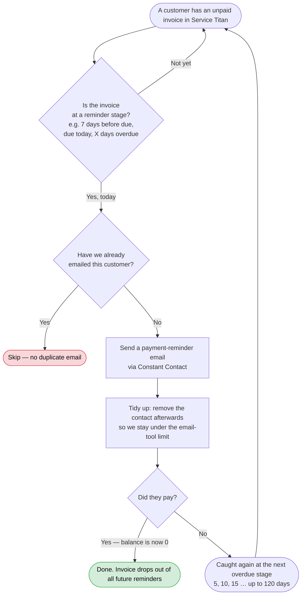
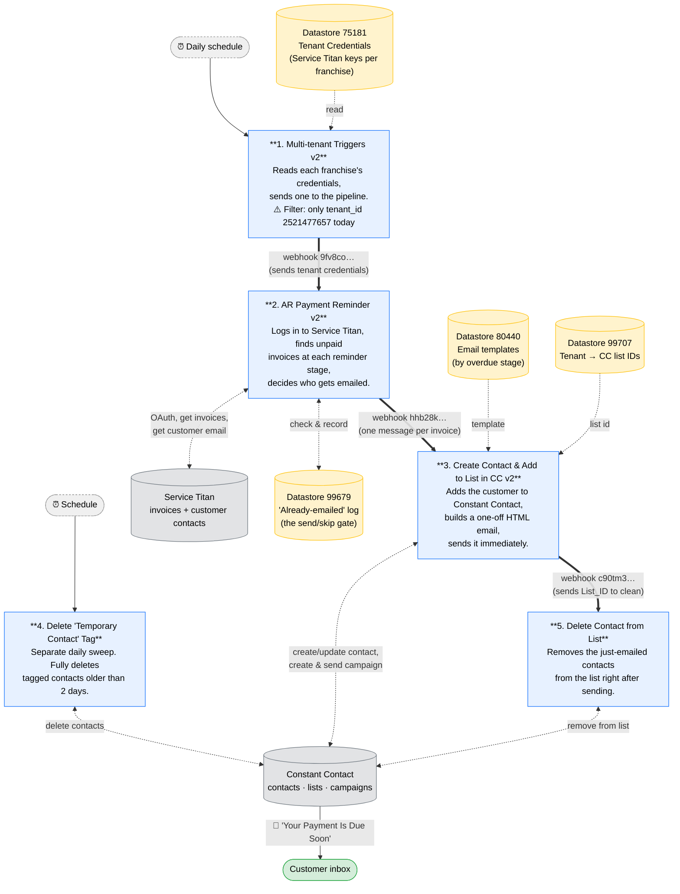
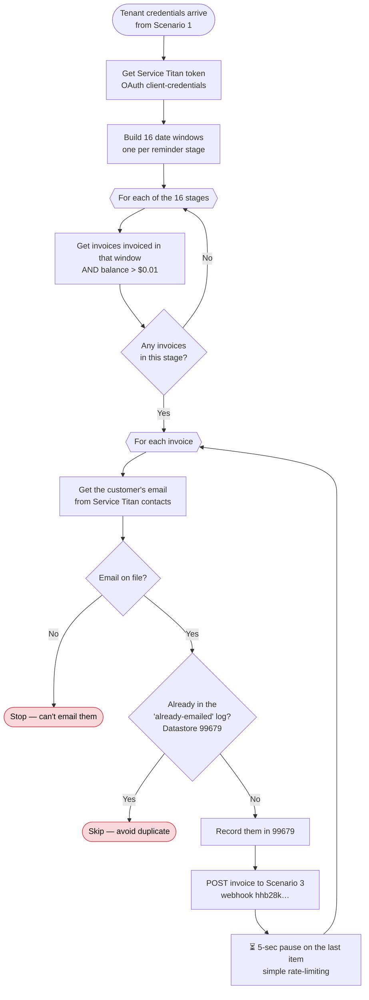
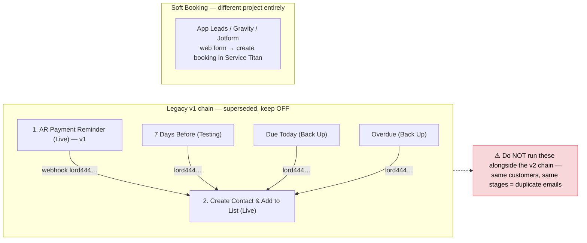

# AR Automation — Owner's Manual

**Owner:** Zerubabel Jember  ·  **Handed over from:** Jack  ·  **Last reviewed:** 2026-06-11
**Stack:** Make.com (us2 zone) · Service Titan (invoice source) · Constant Contact (email sending)

> **What this document is.** The single source of truth for the AR automation: what it does, how
> it works end-to-end, every diagram, and how to fix it when it breaks. If you only keep one file,
> keep this one. A slimmed companion file, [`AR-Flow-Chart.md`](AR-Flow-Chart.md), holds just the diagrams for slides.
>
> **How to read the diagrams.** Open this file in VS Code preview or on GitHub to see them rendered.
> To export an image, paste a ```mermaid``` block into <https://mermaid.live>.

---

## Table of contents

1. [What this project does](#1-what-this-project-does)
2. [Business view (the 60-second picture)](#2-business-view-the-60-second-picture)
3. [Architecture — the five live scenarios](#3-architecture--the-five-live-scenarios)
4. [Scenario-by-scenario reference](#4-scenario-by-scenario-reference)
5. [Datastores, credentials & configuration](#5-datastores-credentials--configuration)
6. [Monitoring & maintenance](#6-monitoring--maintenance)
7. [Troubleshooting runbook](#7-troubleshooting-runbook)
8. [Risks & known issues](#8-risks--known-issues)
9. [Legacy & unrelated scenarios (keep OFF)](#9-legacy--unrelated-scenarios-keep-off)
10. [Onboarding plan & open questions](#10-onboarding-plan--open-questions)
11. [Legend](#legend)

---

## 1. What this project does

Automates accounts-receivable collections for Junk Shot / Accelerated Waste Solutions (ASF).
Every day it pulls unpaid invoices from **Service Titan**, matches them to reminder stages
(7 days before due → due today → 5–120 days overdue, 16 stages total), and emails the customer
a payment reminder through **Constant Contact** (CC). Because CC's plan caps contacts at
~25–30k, contacts are removed right after each send.

**Business problems it solves:** the time the client-success team spent on manual follow-ups,
slow payment collection, and a Constant Contact limitation — its API can only create campaigns
from raw HTML, with no dynamic sender/address blocks. The workaround is to build a fresh one-off
HTML campaign for every single reminder.

---

## 2. Business view (the 60-second picture)

*For anyone who needs the outcome, not the wiring. This is the version to show a manager.*



**In one sentence:** every day the system finds unpaid invoices that have reached a reminder
milestone, emails those customers once per milestone, and stops automatically when they pay.

---

## 3. Architecture — the five live scenarios

**Verified in the Make UI (2026-06-11):** the "Live Automations" folder contains exactly five
scenarios, all toggled ON:

| Trigger | Scenario |
|---------|----------|
| ⏰ Scheduled | **1. Multi-tenant Triggers v2** |
| ⚡ Webhook | **2. AR Payment Reminder v2** |
| ⚡ Webhook | **3. Create Contact and Add to List in Constant Contact v2** |
| ⏰ Scheduled | **4. Delete "Temporary Contact" Tag** |
| ⚡ Webhook | **5. Delete Contact from List** |

The whole system is a **relay race**: each scenario does one job and hands a payload to the next
through a Make webhook. Scenarios 4 and 5 are the two cleanup jobs that keep Constant Contact
under its contact cap.



Thick arrows (`==>`) are the live webhook chain, in order. Dotted arrows are reads/writes to
external systems and datastores.

---

## 4. Scenario-by-scenario reference

| # | Scenario | Trigger | Role | Key external calls |
|---|----------|---------|------|--------------------|
| 1 | Multi-tenant Triggers v2 | Schedule | Fan-out: one webhook call per allowed tenant, with its credentials | Make webhook `9fv8co…` |
| 2 | AR Payment Reminder v2 | Webhook 2308425 | Pull + stage invoices, dedupe, fan out per invoice | ST auth, `accounting/v2/.../invoices`, `crm/v2/.../customers/{id}/contacts`; Make webhook `hhb28k…` |
| 3 | Create Contact & Add to List v2 | Webhook 2269064 | Contact upsert + build & send one-off HTML campaign | CC `/v3/contacts`, `/v3/emails`, `/v3/emails/activities/.../schedules`; Make webhook `c90tm3…` |
| 4 | Delete "Temporary Contact" Tag | Schedule | Purge tagged contacts older than 2 days | CC `/v3/contacts?tags=6ee593ba…`, DELETE `/v3/contacts/{id}` |
| 5 | Delete Contact from List | Webhook 2313509 | Empty a list after the campaign send | CC `listContacts`, `deleteContactsFromLists` |

### Scenario 1 — Multi-tenant Triggers v2

Reads every franchise row from **Datastore 75181** and, for each that passes the filter
`tenant_id == 2521477657`, POSTs that tenant's credentials to Scenario 2's webhook. **This filter
is the multi-tenant on/off switch** — to enable another franchise you add its row to 75181 and add
its tenant_id here. Credentials travel in the webhook payload (not via a Make connection), which is
what lets Scenario 2 serve any tenant.

### Scenario 2 — AR Payment Reminder v2 (the brain)

The clever part: instead of asking "what's due in 7 days?" it asks "what was **invoiced** N days
ago?", because with 30-day terms an invoice's age tells you its stage.



The 16 windows: invoiced 22–23 days ago = *7 days before due*; 29–30 days = *due today*; then
5-day steps from *5 days overdue* to *30*, then *45, 60, 70, 80, 90, 100, 110, 120*. If Service
Titan returns `dueDate == invoiceDate`, the flow assumes due = invoice + 30 days.

**Payload contract from 2 → 3** (don't rename these fields — Scenario 3's mappers depend on them):
`name, email, duedate, invoicedate, number, amount_due, customer portal, tenantNumber,
tenantAddress, tenantEmail, tenantName, tenant_ID, Days Diff, Address Line 1, City, Postal Code,
State Code`.

### Scenario 3 — Create Contact & Add to List (the mouth)

Constant Contact's API can't send a normal templated email to one person, so this scenario builds a
brand-new one-recipient HTML campaign each time, sends it, then asks Scenario 5 to clean up.


The **'Temporary Contact'** tag applied at creation is exactly what Scenario 4 hunts for. The two
scenarios are linked by that tag, not by a webhook.

### Scenarios 5 & 4 — the cleanup crew

- **Scenario 5 (Delete Contact from List)** receives a `List_ID`, lists its contacts (limit 10),
  and removes them. This runs immediately after each send so lists stay tiny. **This is the most
  important business constraint in the project:** the CC plan caps contacts at ~25–30k across
  ~30,000 customers, so contacts can only live in CC for the minutes it takes to send.
- **Scenario 4 (Delete "Temporary Contact" Tag)** is the safety net. Scenario 5 removes contacts
  *from lists*, but the contact records still exist. This daily sweep fully deletes any contact
  tagged `Temporary Contact` that is older than 2 days. Between the two, the contact count stays
  flat. **If either stops running, you drift toward the cap and sends eventually fail.**

---

## 5. Datastores, credentials & configuration

| Datastore | ID | Used by | Contents |
|-----------|----|---------|----------|
| Tenant Credentials | 75181 | 1 (+ v1, Soft Booking) | Per tenant: `tenant_id`, ST `client_ID` / `client_secret` / `app_key`, portal URL, address, `tenant_email`, phone |
| Constant Contact Emails (AR Payment) | 99679 | 2 | "Already-emailed" log: Customer ID + Email of everyone already sent a reminder |
| Constant Contact – Overdue Days | 80440 | 3 (+ Test HTML) | Days-Diff → email HTML template, pre-header, name |
| Constant Contact – Multiple Tenant Lists | 99707 | 3 | tenant_ID → CC list IDs |

**Credentials & connections**
- **Service Titan:** OAuth client-credentials *per tenant*, stored in Datastore 75181 (not in Make
  connections). The `St-App-Key` header is required on every API call.
- **Constant Contact:** Make connection **7441904**, authenticated as **info@acceleratedwaste.com**.
- **Make webhooks (us2):** `9fv8co…` → Scenario 2 · `hhb28k…` → Scenario 3 · `c90tm3…` →
  Scenario 5 · `lord444…` → legacy v1 (off).

**Hardcoded values you may need to change**
- Tenant allowlist filter `tenant_id == 2521477657` in Scenario 1 — *this is where you enable more franchises.*
- CC custom-field UUIDs (Invoice Number, Due Date, Amount Due, etc.) and the tag `6ee593ba…` in Scenario 3.
- From-name "JUNK SHOT – Junk Removal & Valet Trash" and subject "Your Payment Is Due Soon" in Scenario 3.
- Sleeps: 5 s (Scenario 2 last-in-queue), 15–60 s between CC campaign update/send calls.

---

## 6. Monitoring & maintenance

**Routine checks (daily/weekly):**
1. **Make scenario history** for Scenarios 1–5: errors and *incomplete executions* (DLQ is enabled
   on the reminder scenarios). `maxErrors: 3` — a scenario auto-disables after repeated failures,
   which **silently stops all reminders**.
2. **CC contact count** vs the ~25–30k cap — confirms Scenarios 4 and 5 are keeping up.
3. **Datastore 99679 size** — see Risk #2.
4. **Make operations usage** — the team tracks this to compare cost vs Service Titan Marketing Pro.
5. After any **domain-change** work: re-check CC sender verification (see Risk #1).

**Set up error notifications.** Turn on Make's email/Slack alert on scenario error for Scenarios
1, 2, 3, and 5 if not already on. This is your early-warning system.

---

## 7. Troubleshooting runbook

**Universal first step:** open the failed run in **Make → the scenario → History**, click the
execution, and find the **red module**. Click it to see its input bundle. The table below maps the
red module to the likely cause and fix.

| Symptom / where it's red | Likely cause | Fix |
|--------------------------|--------------|-----|
| **No reminders going out at all** | A scenario hit `maxErrors: 3` and auto-disabled; or a webhook in the chain is OFF | In Make, confirm all five live scenarios are toggled ON. Re-enable, then run Scenario 1 manually and watch the chain. |
| Scenario 2 — `POST /connect/token` red, **401** | Service Titan `client_secret` / `app_key` rotated or wrong in Datastore 75181 | Update the tenant's credentials in Datastore 75181. Re-run. |
| Scenario 2 — `GET invoices` red, **4xx** | Wrong `tenant_id`, or missing/!`St-App-Key` header | Check the tenant row in 75181; confirm the App-Key header maps from `app_key`. |
| Scenario 2 — runs fine but **a customer never gets a later overdue reminder** | They're already in the "already-emailed" log (Datastore 99679), which looks append-only | See Risk #2 — confirm the purge process with Jack. As a manual fix, delete that customer's row from 99679. |
| Scenario 2 — **some invoices in a busy stage are missed** | Invoices fetched 20 per call with no paging | See Risk #3. Confirm real volume; add a pagination loop if needed. |
| Scenario 3 — `create campaign` or `schedule send` red, **4xx** | **Constant Contact sender not verified** (domain swap) | Re-verify the sender in CC; update `tenant_email` in 75181; re-auth connection 7441904. **This is the #1 watch item.** |
| Scenario 3 — **429 Too Many Requests** from CC | Hitting CC rate limits | Lengthen the sleep modules (currently 5 / 15 / 30 / 60 s) before changing anything else. |
| Scenario 3 — contact created but **email wrong/blank** | Missing template row in Datastore 80440 for that Days-Diff, or a renamed payload field | Add/fix the 80440 row; confirm the 2→3 payload field names are unchanged. |
| **CC contact count climbing toward the cap** | Scenario 5 and/or 4 not firing | Check both scenarios' history. See Risk #5 — Scenario 5's run count looks low; confirm cleanup fires on every send. |
| Scenario 5 — runs but **deletes nothing** | List already empty, or it received an empty `List_ID` | Check Scenario 3's outgoing webhook payload actually contains the `List_ID`. |
| **Customers getting duplicate emails** | A legacy scenario was re-enabled | Confirm v1 and the Testing/Back Up scenarios are OFF (see §9). |

**Quick decoder:** 4xx from **Service Titan** = credentials / tenant ID. 4xx from **Constant
Contact** = sender verification / list / custom-field IDs. **Empty output** from a datastore
search = a missing config row for that tenant or Days-Diff.

---

## 8. Risks & known issues

1. **Domain migration (acceleratedwaste.com → junkshot) — #1 active risk.** CC supports only one
   authenticated sender; connection 7441904 and the `from_email` (tenant_email in 75181) reference
   the old domain. If sender verification changes, Scenario 3 campaign creation returns 4xx and
   reminders stop. *Fix:* re-verify sender in CC, update `tenant_email` in 75181, re-auth if needed.
2. **"Already-emailed" log (99679) appears append-only.** Once a customer is recorded, Scenario 2
   skips them — so they may not get *escalating* reminders. Nothing in the exported scenarios
   clears it. **Confirm with Jack/Trishia how it's purged** (manual? an unexported scenario?).
3. **Pagination gap.** Scenario 2 fetches invoices `pageSize=20` with no visible page loop. A stage
   with >20 unpaid invoices in one day may drop the overflow. Verify against real volume.
4. **30-day-terms assumption.** Stages filter on invoice *creation* date. Invoices with non-standard
   terms get mis-staged (wrong "days overdue" wording).
5. **Scenario 5 run-count gap.** Its execution count (~333) is far below Scenario 3's (~5,600).
   Confirm list cleanup actually fires on every send, or contacts will accumulate in CC.
6. **Webhook-chain fragility.** If Scenario 3 or 5 is OFF, upstream calls queue or fail quietly.
   After any redeploy, confirm every hook is listening (Make → Webhooks shows the URL ↔ scenario map).
7. **Duplicate-send hazard.** Never enable v1 or the Testing/Back Up scenarios while the v2 chain is
   on — same customers, same stages.
8. **CC rate limits.** The sleeps are the only throttle; if CC returns 429s, lengthen them first.

---

## 9. Legacy & unrelated scenarios (keep OFF)

*Confirmed not in the "Live Automations" folder on 2026-06-11. Documented so nobody re-enables them
by accident.*



- **Legacy v1 chain:** "1. AR Payment Reminder (Live)" → "2. Create Contact & Add to List (Live)",
  plus the three "7 Days Before / Due Today / Overdue (Testing/Back Up)" single-stage scenarios.
  All post to the `lord444…` webhook. Superseded by the v2 chain.
- **Development/test scenarios:** "3. Send Email Campaigns (Development)" and "Update Email Campaign
  and Schedule Send (Development)" share the *same* hardcoded campaign ID `75ada86c-…` and list
  `6d07b0a4-…` — running both corrupts each other's state. "Test HTML Campaigns" is a sandbox for
  the create-via-HTML approach.
- **Soft Booking (App Leads / Gravity / Jotform):** a separate lead-to-booking project (web form →
  tenant lookup via the "Tenant Zones" Google Sheet → create a booking in Service Titan). It shares
  only Datastore 75181 with AR; no data flows between them.

---

## 10. Onboarding plan & open questions

**Day 1 — Access & ground truth.** Get Make, CC, and Service Titan logins (Trishia). In Make: list
all scenarios, record which are ON and their **schedule times** (blueprints don't export these), and
open Webhooks to confirm the URL ↔ scenario mapping in §5. Open the four datastores and skim rows.

**Day 2 — Trace a real run.** Pick a recent successful run of 1 → 2 → 3 → 5 in history and follow one
invoice end-to-end: stage chosen, dedupe result, template + list picked, campaign created in CC,
contacts deleted after. Cross-check the campaign in CC's UI. Try to answer the open questions below.

**Day 3 — Prove you can operate it.** Export fresh blueprints as your own backup. Run Scenario 2
manually with a test tenant payload against a known test invoice. Make one safe config change (e.g.,
add a template row in Datastore 80440) and verify it flows. Turn on error notifications. Send Trishia
this manual + the flow chart and your answers to the open questions.

**Open questions to confirm with Jack / Trishia:**
1. ✅ *Which scenarios are intentionally ON?* — Confirmed 2026-06-11: the five in "Live Automations"; v1 is retired.
2. **How and when is the "already-emailed" log (Datastore 99679) cleared?** (Risk #2)
3. **Why is Scenario 5's run count so much lower than Scenario 3's?** Does cleanup fire on every send? (Risk #5)
4. **Status of the domain swap** and CC sender re-verification? (Risk #1)
5. **Exact schedule times** for Scenarios 1 and 4 (read off the Make UI; record them in §3).
6. Is a **multi-tenant rollout** planned (more tenant_ids in Scenario 1's filter), and are Datastores 99707 / 80440 populated for those tenants?

---

## Legend

| Symbol | Meaning |
|--------|---------|
| 🟦 Blue box | A Make.com scenario (one of the five live automations) |
| 🟨 Yellow cylinder | A Make **datastore** (config/state stored inside Make) |
| ⬜ Grey cylinder | An **external system** (Service Titan, Constant Contact) |
| Thick arrow `==>` | A live **webhook** call — the relay chain, in order |
| Dotted arrow | A read/write to an external system or datastore |
| 🟥 Red box | A point where processing **stops** for that invoice (by design) |
| 🟩 Green box | A successful end state |
| ⚠️ | An **open question** still to confirm — see §10 |
