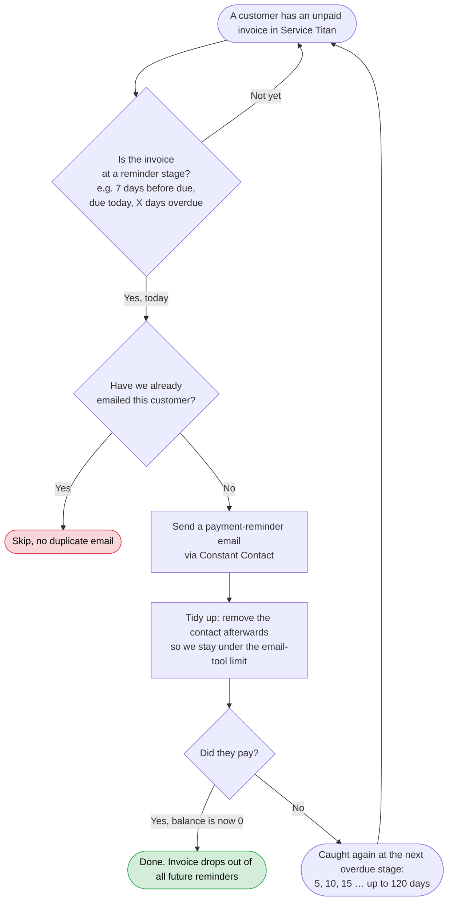
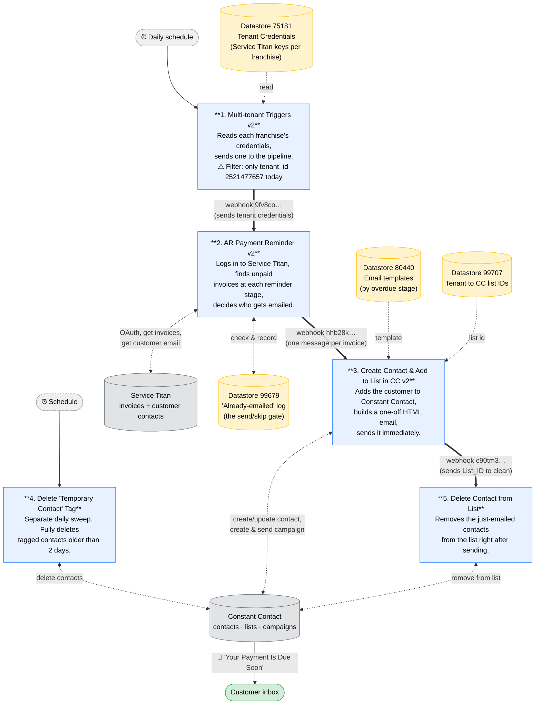
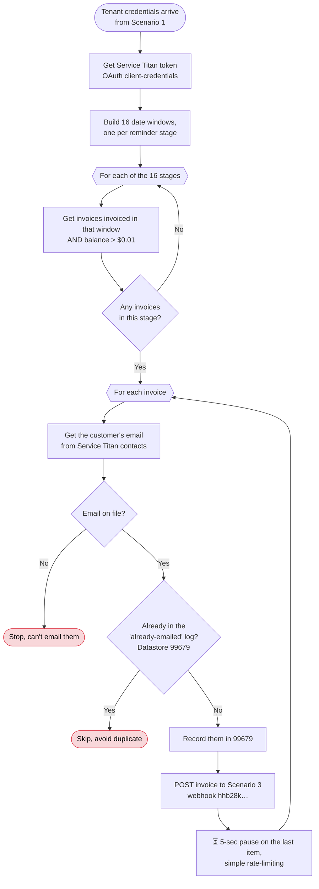
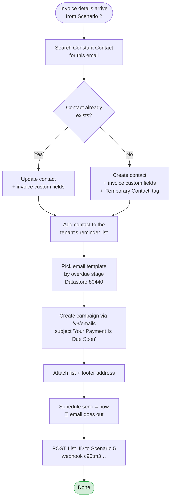

# AR Automation

Documentation for the **Accounts Receivable (AR) automation**: a Make.com pipeline that pulls
unpaid invoices from Service Titan every day and emails customers staged payment reminders through
Constant Contact.

> This README is the single source of truth for the system: what it does, how it works end to end,

---

## Table of contents

1. [What this project does](#1-what-this-project-does)
2. [Business view ](#2-business-view)
3. [Architecture: the five live scenarios](#3-architecture-the-five-live-scenarios)
4. [Scenario-by-scenario reference](#4-scenario-by-scenario-reference)
5. [Datastores, credentials and configuration](#5-datastores-credentials-and-configuration)

6. [Concerns](#6-Concerns)

7. [Legend](#legend)

---

## 1. What this project does

The AR automation handles accounts-receivable collections for Junk Shot / Accelerated Waste
Solutions (ASF). Every day it pulls unpaid invoices from **Service Titan**, matches them to reminder
stages (7 days before due, due today, then 5 to 120 days overdue, 16 stages in total), and emails
the customer a payment reminder through **Constant Contact** (CC). Because CC's plan caps contacts at
roughly 25,000 to 30,000, contacts are removed right after each send.

It exists to solve three problems: the time the client-success team spent on manual follow-ups, slow
payment collection, and a Constant Contact limitation. CC's API can only create campaigns from raw
HTML, with no dynamic sender or address blocks, so the system works around that by building a fresh
one-off HTML campaign for every single reminder.

---

## 2. Business view 
This is the version to show our clients : the outcome, not the wiring.

In short, every day the system finds unpaid invoices that have reached a reminder milestone,
emails those customers once per milestone, and stops automatically when they pay.

---

## 3. Architecture: the five live scenarios

The "Live Automations" folder in Make contains exactly five scenarios, all toggled ON.

| Trigger | Scenario |
|---------|----------|
| ⏰ Scheduled | **1. Multi-tenant Triggers v2** |
| ⚡ Webhook | **2. AR Payment Reminder v2** |
| ⚡ Webhook | **3. Create Contact and Add to List in Constant Contact v2** |
| ⏰ Scheduled | **4. Delete "Temporary Contact" Tag** |
| ⚡ Webhook | **5. Delete Contact from List** |

The whole system is a **relay race**: each scenario does one job and hands a payload to the next
through a Make webhook. Scenarios 4 and 5 are the two cleanup jobs that keep Constant Contact under
its contact cap.

Thick arrows (`==>`) are the live webhook chain, in order. Dotted arrows are reads and writes to
external systems and datastores.

---

## 4. Scenario-by-scenario reference

| # | Scenario | Trigger | Role | Key external calls |
|---|----------|---------|------|--------------------|
| 1 | Multi-tenant Triggers v2 | Schedule | Fan-out: one webhook call per allowed tenant, with its credentials | Make webhook `9fv8co…` |
| 2 | AR Payment Reminder v2 | Webhook 2308425 | Pull and stage invoices, dedupe, fan out per invoice | ST auth, `accounting/v2/.../invoices`, `crm/v2/.../customers/{id}/contacts`; Make webhook `hhb28k…` |
| 3 | Create Contact & Add to List v2 | Webhook 2269064 | Contact upsert, build and send a one-off HTML campaign | CC `/v3/contacts`, `/v3/emails`, `/v3/emails/activities/.../schedules`; Make webhook `c90tm3…` |
| 4 | Delete "Temporary Contact" Tag | Schedule | Purge tagged contacts older than 2 days | CC `/v3/contacts?tags=6ee593ba…`, DELETE `/v3/contacts/{id}` |
| 5 | Delete Contact from List | Webhook 2313509 | Empty a list after the campaign send | CC `listContacts`, `deleteContactsFromLists` |

### Scenario 1: Multi-tenant Triggers v2

Reads every franchise row from **Datastore 75181** and, for each that passes the filter
`tenant_id == 2521477657`, POSTs that tenant's credentials to Scenario 2's webhook. This filter is
the multi-tenant on/off switch: to enable another franchise you add its row to 75181 and add its
tenant_id here. Credentials travel inside the webhook payload (not via a Make connection), which is
what lets Scenario 2 serve any tenant.

### Scenario 2: AR Payment Reminder v2 (the brain)

The key idea: instead of asking "what's due in 7 days?" it asks "what was **invoiced** N days ago?",
because with 30-day terms an invoice's age tells you its stage.

The 16 windows: invoiced 22 to 23 days ago is *7 days before due*; 29 to 30 days is *due today*; then
5-day steps from *5 days overdue* to *30*, then *45, 60, 70, 80, 90, 100, 110, 120*. If Service Titan
returns `dueDate == invoiceDate`, the flow assumes due = invoice date + 30 days.

**Payload contract from 2 to 3** (don't rename these fields; Scenario 3's mappers depend on them):
`name, email, duedate, invoicedate, number, amount_due, customer portal, tenantNumber,
tenantAddress, tenantEmail, tenantName, tenant_ID, Days Diff, Address Line 1, City, Postal Code,
State Code`.

### Scenario 3: Create Contact & Add to List (the mouth)

Constant Contact's API can't send a normal templated email to one person, so this scenario builds a
brand-new one-recipient HTML campaign each time, sends it, then asks Scenario 5 to clean up.

The `Temporary Contact` tag applied at creation is exactly what Scenario 4 hunts for. The two
scenarios are linked by that tag, not by a webhook.

### Scenarios 5 and 4: the cleanup crew

- **Scenario 5 (Delete Contact from List)** receives a `List_ID`, lists its contacts (limit 10), and
  removes them. This runs immediately after each send so lists stay tiny. This is the most important
  business constraint in the project: the CC plan caps contacts at roughly 25,000 to 30,000 across
  about 30,000 customers, so contacts can only live in CC for the few minutes it takes to send.
- **Scenario 4 (Delete "Temporary Contact" Tag)** is the safety net. Scenario 5 removes contacts
  *from lists*, but the contact records still exist. This daily sweep fully deletes any contact
  tagged `Temporary Contact` that is older than 2 days. Between the two, the contact count stays flat.
  If either stops running, the count drifts toward the cap and sends eventually fail.

---

## 5. Datastores, credentials and configuration

| Datastore | ID | Used by | Contents |
|-----------|----|---------|----------|
| Tenant Credentials | 75181 | 1 (plus v1, Soft Booking) | Per tenant: `tenant_id`, ST `client_ID` / `client_secret` / `app_key`, portal URL, address, `tenant_email`, phone |
| Constant Contact Emails (AR Payment) | 99679 | 2 | "Already-emailed" log: Customer ID and Email of everyone already sent a reminder |
| Constant Contact, Overdue Days | 80440 | 3 (plus Test HTML) | Days-Diff to email HTML template, pre-header, name |
| Constant Contact, Multiple Tenant Lists | 99707 | 3 | tenant_ID to CC list IDs |

**Credentials and connections**
- **Service Titan:** OAuth client-credentials *per tenant*, stored in Datastore 75181 (not in Make
  connections). The `St-App-Key` header is required on every API call.
- **Constant Contact:** Make connection **7441904**, authenticated as **info@acceleratedwaste.com**.
- **Make webhooks (us2):** `9fv8co…` to Scenario 2 · `hhb28k…` to Scenario 3 · `c90tm3…` to
  Scenario 5 · `lord444…` to legacy v1 (off).

**Hardcoded values that may need to change**
- Tenant allowlist filter `tenant_id == 2521477657` in Scenario 1. This is where you enable more franchises.
- CC custom-field UUIDs (Invoice Number, Due Date, Amount Due, etc.) and the tag `6ee593ba…` in Scenario 3.
- From-name "JUNK SHOT, Junk Removal & Valet Trash" and subject "Your Payment Is Due Soon" in Scenario 3.
- Sleeps: 5 s (Scenario 2 last-in-queue), 15 to 60 s between CC campaign update and send calls.

---

## 6. Concerns

1. **Pagination gap.** Scenario 2 fetches invoices `pageSize=20` with no visible page loop. A stage
   with more than 20 unpaid invoices in one day may drop the overflow. Verify against real volume.
2. **30-day-terms assumption.** Stages filter on invoice *creation* date. Invoices with non-standard
   terms get mis-staged (wrong "days overdue" wording).

---

